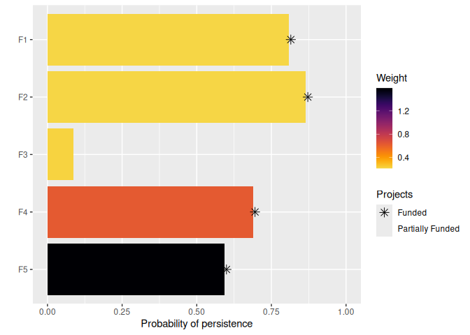

<!--- README.md is generated from README.Rmd. Please edit that file -->
Project Prioritization
======================

[](https://www.tidyverse.org/lifecycle/#maturing) [](https://travis-ci.org/prioritizr/ppr) [](https://ci.appveyor.com/project/jeffreyhanson/ppr) [](https://codecov.io/github/prioritizr/ppr?branch=master) [](https://CRAN.R-project.org/package=ppr)

**This package is still under development and not ready for use. Please do not use this package yet.**

The *ppr R* package is decision support tool for prioritizing conservation projects. Prioritizations can be developed by maximizing expected feature richness, expected phylogenetic diversity, the number of feature that meet persistence targets, or identifying a set of projects that meet persistence targets for minimal cost. Constraints (e.g. lock in specific actions) and feature weights can also be specified to further customize prioritizations. After defining a project prioritization problem, solutions can be obtained using exact algorithms, heuristic algorithms, or random processes. In particular, it is recommended to install the ['Gurobi' optimizer](https://www.gurobi.com) because it can identify optimal solutions very quickly. Finally, methods are provided for comparing different prioritizations and evaluating their benefits.

Installation
------------

The development version of the *ppr R* package can be installed using the following code. Please note that you will need install the *ggtree* package from Bioconductor since it is not available on [The Comprehensive R Archive Network](https://cran.r-project.org/).

``` r
if (!require(devtools))
  install.packages("devtools")
devtools::install_github("prioritizr/ppr")
if (!require(ggtree))
  devtools::install_bioc("ggtree")
```

### *Rsymphony* solver

This package depends on the [*Rsymphony R* package](https://cran.r-project.org/web/packages/Rsymphony/index.html). Unfortunately, Mac OSX and Linux users may need to manually install the [*SYMHPONHY* software](https://projects.coin-or.org/SYMPHONY) before they can install the [*Rsymphony R* package](https://cran.r-project.org/web/packages/Rsymphony/index.html) and, in turn, the *ppr R* package. The [*SYMHPONHY* software](https://projects.coin-or.org/SYMPHONY) can be installed on Mac OSX systems using the [Homebrew](https://brew.sh/) commands:

    brew tap coin-or-tools/coinor
    brew install symphony
    brew install pkg-config

And the [*SYMHPONHY* software](https://projects.coin-or.org/SYMPHONY) can be installed on Linux (specifically, Ubuntu) systems using the system commands:

    sudo apt-get update
    sudo apt-get install coinor-libcgl-dev coinor-libclp-dev \
    coinor-libcoinutils-dev coinor-libosi-dev coinor-libsymphony-dev \
    coinor-libsymphony-doc coinor-libsymphony3

### Gurobi solver

We also recommend installing the [Gurobi optimization suite](http://www.gurobi.com/) and [*gurobi R* package](https://www.gurobi.com/documentation/8.1/refman/r_api_overview.html) to obtain solutions very quickly. For instructions on installing these software packages, please refer to [this installation guide](https://cran.r-project.org/web/packages/prioritizr/vignettes/gurobi_installation.html).

Usage
-----

Here we will provide a short example showing how the *optimalppp R* package can be used to prioritize funding for conservation projects. To start off, we will set the seed for the random number generator to ensure you get the same results as shown here, and load the *ppr R* package.

``` r
set.seed(500)
library(ppr)
```

Now we will load some data sets that are distributed with the package. First, we will load the `sim_features` object. This table contains information on the conservation features (e.g. species). Specifically, each row corresponds to a different feature, and each column contains information associated with the features. In this table, the `"name"` column contains the name of each feature, and the `"weight"` column denotes the relative importance for each feature.

``` r
# load data
data(sim_features)

# print table
print(sim_features)
```

    ## # A tibble: 5 x 2
    ##   name  weight
    ##   <chr>  <dbl>
    ## 1 F1     0.211
    ## 2 F2     0.211
    ## 3 F3     0.221
    ## 4 F4     0.630
    ## 5 F5     1.59

Next, we will load the `sim_actions` object. This table stores information about the various management actions (i.e. `tibble`). Each row corresponds to a different action, and each column describes different properties associated with the actions. These actions correspond to specific management actions that have known costs. For example, they may relate to pest eradication activities in sites of conservation importance. In this table, the `"name"` column contains the name of each action, and the `"cost"` action denotes the cost of funding each project. It also contains additional columns for customizing the solutions, but we will ignore them for now. Note that the last project---the `"baseline_action"`---has a zero cost and is used subsequently to represent the baseline probability for feature when no conservation actions are funded for them.

``` r
# load data
data(sim_actions)

# print table
print(sim_actions)
```

    ## # A tibble: 6 x 4
    ##   name             cost locked_in locked_out
    ##   <chr>           <dbl> <lgl>     <lgl>     
    ## 1 F1_action        94.4 FALSE     FALSE     
    ## 2 F2_action       101.  FALSE     FALSE     
    ## 3 F3_action       103.  TRUE      FALSE     
    ## 4 F4_action        99.2 FALSE     FALSE     
    ## 5 F5_action        99.9 FALSE     TRUE      
    ## 6 baseline_action   0   FALSE     FALSE

Additionally, we will load the `sim_projects` object. This table stores information about various conservation projects. Each row corresponds to a different project, and each column describes various properties associated with the projects. These projects correspond to groups of conservation actions. For example, a conservation project may pertain to a set of conservation actions that relate to a single feature or single geographic locality. In this table, the `"name"` column contains the name of each project, the `"success"` column denotes the probability of each project succeeding if it is funded, the `"F1"`--`"F5"` columns show the probability of each feature is expected to persist if each project is funded (`NA` values mean that a feature does not benefit from a project), and the `"F1_action"`--`"F5_action"` columns indicate which actions are associated with which projects. Note that the last project---the `"baseline_project"`---is associated with the `"baseline_action"` action. This project has a zero cost and represents the baseline probability of each feature persisting if no other project is funded. Finally, although most projects in this example directly relate to a single feature, you can input projects that directly affect the persistence of multiple feature.

``` r
# load data
data(sim_projects)

# print table
print(sim_projects, width = Inf)
```

    ## # A tibble: 6 x 13
    ##   name             success     F1     F2      F3     F4     F5 F1_action
    ##   <chr>              <dbl>  <dbl>  <dbl>   <dbl>  <dbl>  <dbl> <lgl>    
    ## 1 F1_project         0.919  0.791 NA     NA      NA     NA     TRUE     
    ## 2 F2_project         0.923 NA      0.888 NA      NA     NA     FALSE    
    ## 3 F3_project         0.829 NA     NA      0.502  NA     NA     FALSE    
    ## 4 F4_project         0.848 NA     NA     NA       0.690 NA     FALSE    
    ## 5 F5_project         0.814 NA     NA     NA      NA      0.617 FALSE    
    ## 6 baseline_project   1      0.298  0.250  0.0865  0.249  0.182 FALSE    
    ##   F2_action F3_action F4_action F5_action baseline_action
    ##   <lgl>     <lgl>     <lgl>     <lgl>     <lgl>          
    ## 1 FALSE     FALSE     FALSE     FALSE     FALSE          
    ## 2 TRUE      FALSE     FALSE     FALSE     FALSE          
    ## 3 FALSE     TRUE      FALSE     FALSE     FALSE          
    ## 4 FALSE     FALSE     TRUE      FALSE     FALSE          
    ## 5 FALSE     FALSE     FALSE     TRUE      FALSE          
    ## 6 FALSE     FALSE     FALSE     FALSE     TRUE

After loading the data, we can begin formulating the project prioritization problem. Here our goal is to maximize the overall probability that each feature is expected to persist into the future (i.e. the feature richness), whilst also accounting for the relative importance of each feature and the fact that our resources are limited such that we can only spend at most $400 on funding management actions. Now, let's build a project prioritization problem object that represents our goal.

``` r
# build problem
p <- problem(projects = sim_projects, actions = sim_actions,
             features =  sim_features, project_name_column = "name",
             project_success_column = "success", action_name_column = "name",
             action_cost_column = "cost", feature_name_column = "name") %>%
     add_max_richness_objective(budget = 400) %>%
     add_feature_weights(weight = "weight") %>%
     add_binary_decisions() %>%
     add_default_solver(verbose = FALSE)

# print problem
print(p)
```

    ## Project Prioritization Problem
    ##   actions          F1_action, F2_action, F3_action, ... (6 actions)
    ##   projects         F1_project, F2_project, F3_project, ... (6 projects)
    ##   features         F1, F2, F3, ... (5 features)
    ##   action costs:    min: 0, max: 103.22583
    ##   project success: min: 0.81379, max: 1
    ##   objective:       Maximum richness objective [budget (400)]
    ##   targets:         none
    ##   weights:         min: 0.21136, max: 1.59167
    ##   decisions        Binary decision 
    ##   constraints:     <none>
    ##   solver:          Gurobi [first_feasible (0), gap (0), number_solutions (1), presolve (2), solution_pool_method (2), threads (1), time_limit (2147483647), time_limit (2147483647), verbose (0)]

Next, we can solve this problem to obtain a solution. By default, we will obtain the optimal solution to our problem using an exact algorithm solver (e.g. using [Gurobi](http://www.gurobi.com/) or [Rsymphony](https://cran.r-project.org/package=Rsymphony)).

``` r
# solve problem
s <- solve(p)
```

``` r
# print solution
print(s, width = Inf)
```

    ## # A tibble: 1 x 15
    ##   solution status    obj  cost F1_action F2_action F3_action F4_action
    ##      <int> <chr>   <dbl> <dbl>     <dbl>     <dbl>     <dbl>     <dbl>
    ## 1        1 OPTIMAL  1.51  395.         1         1         0         1
    ##   F5_action baseline_action    F1    F2     F3    F4    F5
    ##       <dbl>           <dbl> <dbl> <dbl>  <dbl> <dbl> <dbl>
    ## 1         1               1 0.727 0.820 0.0865 0.585 0.502

The `s` table contains the solution and also various statistics associated with the solution. Here, each row corresponds to a different solution. Specifically, the `"solution"` column contains an identifier for the solution (which may be useful for methods that output multiple solutions), the `"obj"` column contains the objective value (i.e. the expected feature richness for this problem), the `"cost"` column stores the cost of the solution, and the `"status"` column contains information from the solver about the solution. Additionally, it contains columns for each action (`"F1_action"`, `"F2_actions"`, `"F3_actions"`, ..., `"baseline_action"`) which indicate if each action was prioritized for funding in the solution. Furthermore, it contains column for each feature (`"F1`, `"F2"`, `"F3`, ...) which indicate the probability that each feature is expected to persist into the future under each solution. Since tabular data can be difficult to understand, let's visualize how well this solution would conserve the features. Note that features which benefit from fully funded projects, excepting the baseline project, are denoted with an asterisk.

``` r
# visualize solution
plot_feature_persistence(p, s)
```



This has just been a taster of the *ppr R* package. For more information, see the [package vignette](https://prioritizr.github.io/ppr/articles/ppr.html).

Citation
--------

Please use the following citation to cite the *ppr R* package in publications:

**This package is still under development and not ready for use. Please do not use this package yet.**

Hanson JO, Schuster R, Strimas-Mackey M, Bennett J, (2019). ppr: Project Prioritization. R package version 0.0.0.1. Available at <https://github.com/prioritizr/ppr>.
