# Optimal Project Prioritization

## Overview

The *oppr R* package is decision support tool for prioritizing
conservation projects. Prioritizations can be developed by maximizing
expected feature richness, expected phylogenetic diversity, the number
of features that meet persistence targets, or identifying a set of
projects that meet persistence targets for minimal cost. Constraints
(e.g. lock in specific actions) and feature weights can also be
specified to further customize prioritizations. After defining a project
prioritization problem, solutions can be obtained using exact
algorithms, heuristic algorithms, or random processes. In particular, it
is recommended to install the [‘Gurobi’
optimizer](https://www.gurobi.com) because it can identify optimal
solutions very quickly. Finally, methods are provided for comparing
different prioritizations and evaluating their benefits.

## Tutorial

### Introduction

Here we will provide a short tutorial showing how the *oppr R* package
can be used to prioritize funding for conservation projects. This
package is a general purpose project prioritization decision support
tool. It can generate solutions for species-based project prioritization
problems (Joseph *et al.* 2009; Bennett *et al.* 2014) and priority
threat management problems (Carwardine *et al.* 2018). To develop a
project prioritization, this package requires data for (i) *conservation
projects*, (ii) *management actions* data, and (iii) *biodiversity
features*.

Briefly, biodiversity features are the biological entities that we wish
would persist into the future (e.g. threatened populations, native
species, eco-systems). These *biodiversity features* can (and ideally
should) include non-threatened species, but should not include
threatening processes that we wish to eradicate (e.g. populations of
invasive species). *Management actions* are acts that can be undertaken
to enhance biodiversity (e.g. planting native species, reintroducing
native species, trapping pest species). Each action should pertain to a
specific location (e.g. a national park) or area (e.g. an entire
country), and should be associated with a cost estimate. To guide the
prioritization, the management actions are grouped into *conservation
projects* (also termed “strategies”). Typically, management actions are
grouped into conservation projects based on spatial (e.g. management
actions that pertain to the same area), taxonomic (e.g. management
actions that pertain to the same pest species or threatened species), or
thematic criteria (e.g. management actions that pertain to pest
eradication are grouped into a “pest project”, and actions that pertain
to habitat restoration are grouped into a “habitat project”).
Additionally, some conservation projects can be combinations of other
projects (e.g. a “pest and habitat project”). Each conservation project
should be associated with (i) a probability of succeeding if it is
implemented (also termed “feasibility”), (ii) information about which
management actions are associated with it, and (iii) an estimate of how
likely each conservation feature affected by the project is to persist
into the future if the project is implemented (often derived using
expert elicitation). The conservation projects should also include a
“baseline project” that represents a “do nothing scenario” which has a
100% chance of succeeding and is associated with an action that costs
nothing to implement. This is important because we can’t find a
cost-effective solution if we don’t know how much each project improves
a species’ chance at persistence. For more background information on
project prioritization, please refer to Carwardine *et al.* (2018).

To start off, we will initialize the random number generator to ensure
reproducibility. Next, we will load the *oppr R* package. And then we
will load the *ggplot2*, *tibble*, and *tidyr R* packages to help with
data for visualizations and wrangling.

``` r
# set random number generated seed
set.seed(1000)
# load oppr package for project prioritization
library(oppr)
# load ggplot2 package for plotting
library(ggplot2)
# load tibble package for working with tabular data
library(tibble)
# load tidyr package for reshaping tabular data
library(tidyr)
```

### Data simulation

Now we will simulate a dataset to practice developing project
prioritizations. Specifically, we will simulate a dataset for a priority
threat management exercise that contains 40 features, 70 projects, and
30 actions.

``` r
# simulate data
sim_data <- simulate_ptm_data(
  number_projects = 70, number_actions = 30,
  number_features = 40
)

# extract project, action, feature data
projects <- sim_data$projects
actions <- sim_data$actions
features <- sim_data$features

# manually set feature weights for teaching purposes
features$weight <- exp(runif(nrow(features), 1, 15))

# print data
print(projects) # data for conservation projects
```

    # # A tibble: 71 × 73
    #    name     success     F1    F2    F3     F4     F5     F6     F7     F8     F9
    #    <chr>      <dbl>  <dbl> <dbl> <dbl>  <dbl>  <dbl>  <dbl>  <dbl>  <dbl>  <dbl>
    #  1 project…   0.720  0.672    NA    NA NA      0.704 NA     NA      0.523 NA    
    #  2 project…   0.859  0.514    NA    NA  0.832  0.616 NA     NA      0.547  0.687
    #  3 project…   0.724 NA        NA    NA  0.812 NA     NA     NA     NA      0.627
    #  4 project…   0.768  0.505    NA    NA NA     NA      0.530  0.708 NA     NA    
    #  5 project…   0.856  0.539    NA    NA NA     NA      0.844  0.608  0.590 NA    
    #  6 project…   0.891 NA        NA    NA NA     NA      0.563 NA     NA     NA    
    #  7 project…   0.874  0.546    NA    NA NA      0.682  0.576  0.676  0.737 NA    
    #  8 project…   0.932  0.593    NA    NA NA     NA      0.803  0.580  0.666 NA    
    #  9 project…   0.900 NA        NA    NA  0.572  0.547 NA     NA     NA     NA    
    # 10 project…   0.952 NA        NA    NA NA     NA     NA     NA     NA     NA    
    # # ℹ 61 more rows
    # # ℹ 62 more variables: F10 <dbl>, F11 <dbl>, F12 <dbl>, F13 <dbl>, F14 <dbl>,
    # #   F15 <dbl>, F16 <dbl>, F17 <dbl>, F18 <dbl>, F19 <dbl>, F20 <dbl>,
    # #   F21 <dbl>, F22 <dbl>, F23 <dbl>, F24 <dbl>, F25 <dbl>, F26 <dbl>,
    # #   F27 <dbl>, F28 <dbl>, F29 <dbl>, F30 <dbl>, F31 <dbl>, F32 <dbl>,
    # #   F33 <dbl>, F34 <dbl>, F35 <dbl>, F36 <dbl>, F37 <dbl>, F38 <dbl>,
    # #   F39 <dbl>, F40 <dbl>, action_1 <lgl>, action_2 <lgl>, action_3 <lgl>, …

``` r
print(actions) # data for management actions
```

    # # A tibble: 31 × 4
    #    name       cost locked_in locked_out
    #    <chr>     <dbl> <lgl>     <lgl>     
    #  1 action_1   97.8 FALSE     FALSE     
    #  2 action_2   94.0 FALSE     FALSE     
    #  3 action_3  100.  FALSE     FALSE     
    #  4 action_4  103.  FALSE     FALSE     
    #  5 action_5   96.1 FALSE     FALSE     
    #  6 action_6   98.1 FALSE     FALSE     
    #  7 action_7   97.6 FALSE     FALSE     
    #  8 action_8  104.  FALSE     FALSE     
    #  9 action_9   99.9 FALSE     FALSE     
    # 10 action_10  93.1 FALSE     FALSE     
    # # ℹ 21 more rows

``` r
print(features) # data for biodiversity features
```

    # # A tibble: 40 × 2
    #    name     weight
    #    <chr>     <dbl>
    #  1 F1       210.  
    #  2 F2         7.64
    #  3 F3         7.99
    #  4 F4      7732.  
    #  5 F5     34905.  
    #  6 F6         3.31
    #  7 F7      1168.  
    #  8 F8    108301.  
    #  9 F9         3.62
    # 10 F10     6956.  
    # # ℹ 30 more rows

### Prioritizations with exact algorithms

Let’s assume that we want to maximize the overall persistence of the
conservation features, and that we can only spend \$1,000 funding
management actions. We will also assume that our decisions involve
either funding management actions or not (in other words, our decisions
are binary). For the moment, let’s assume that we value the persistence
of each feature equally. Given this information, we can generate a
project prioritization problem object that matches our specifications.

``` r
# build problem
p1 <- problem(
  projects = projects, actions = actions, features = features,
  "name", "success", "name", "cost", "name"
) %>%
  add_max_richness_objective(budget = 1000) %>%
  add_binary_decisions()

# print problem
print(p1)
```

    # Project Prioritization Problem
    # actions:         action_1, action_2, action_3, ... (31 actions)
    # projects:        project_1, project_2, project_3, ... (71 projects)
    # features:        F1, F2, F3, ... (40 features)
    # action costs:    continuous values (between 0 and 113.35)
    # project success: proportion values (between 0.702 and 1)
    # objective:       maximum richness objective
    # targets:         none specified
    # weights:         none specified
    # constraints:     none specified
    # decisions:       binary decision
    # solver:          none specified

After building the problem, we can solve it. Although backwards
heuristic algorithms have conventionally been used to solve project
prioritization problems (e.g. Joseph *et al.* 2009; Bennett *et al.*
2014; Gerber *et al.* 2018), here we will use exact algorithms to
develop a prioritization. Exact algorithms are superior to heuristic
algorithms because they can provide guarantees on solution quality
(Underhill 1994; Rodrigues & Gaston 2002). In other words, if you
specify that you want an optimal solution when using exact algorithms,
then you are guaranteed to get an optimal solution. Heuristic
algorithms—and even more advanced meta-heuristic algorithms such as
simulated annealing that are commonly to guide conservation decision
making (Kirkpatrick *et al.* 1983)—provide no such guarantees and can
actually deliver remarkably poor solutions (e.g. Beyer *et al.* 2016).
Later on we will experiment with heuristic algorithms, but for now, we
will use exact algorithms. Since we haven’t explicitly stated which
solver we would like to use, the *oppr R* package will identify the best
exact algorithm solver currently installed on your system. This is
typically the *lpSolveAPI R* package unless you have manually installed
the [*gurobi R*
package](https://support.gurobi.com/hc/en-us/articles/14462206790033-How-do-I-install-Gurobi-for-R)
and the [Gurobi optimization suite](https://www.gurobi.com/). Although
not shown here, when you try solving the problem you will see
information printed to your screen as the solver tries to find an
optimal solution. Please do not be alarmed, this is normal behavior and
some of the information can actually be useful (e.g. to estimate how
long it might take to solve the problem).

``` r
# solve problem
s1 <- solve(p1)
```

``` r
# print solution
print(s1)
```

    # # A tibble: 1 × 146
    #   solution status   cost   obj action_1 action_2 action_3 action_4 action_5
    #      <int> <chr>   <dbl> <dbl>    <dbl>    <dbl>    <dbl>    <dbl>    <dbl>
    # 1        1 OPTIMAL  993.  31.0        1        1        0        0        0
    # # ℹ 137 more variables: action_6 <dbl>, action_7 <dbl>, action_8 <dbl>,
    # #   action_9 <dbl>, action_10 <dbl>, action_11 <dbl>, action_12 <dbl>,
    # #   action_13 <dbl>, action_14 <dbl>, action_15 <dbl>, action_16 <dbl>,
    # #   action_17 <dbl>, action_18 <dbl>, action_19 <dbl>, action_20 <dbl>,
    # #   action_21 <dbl>, action_22 <dbl>, action_23 <dbl>, action_24 <dbl>,
    # #   action_25 <dbl>, action_26 <dbl>, action_27 <dbl>, action_28 <dbl>,
    # #   action_29 <dbl>, action_30 <dbl>, baseline_action <dbl>, project_1 <lgl>, …

The `s1` table contains the solution (i.e. a prioritization) and also
various statistics associated with the solution. Here, each row
corresponds to a different solution. By default only one solution will
be returned, and so the table has one row. The `"solution"` column
contains an integer identifier for the solution (this is when multiple
solutions are output), the `"obj"` column contains the objective value
(i.e. the expected feature richness in this case), the `"cost"` column
stores the cost of the solution, and the `"status"` column contains
information from the solver about the solution (i.e. it found an optimal
solution). Additionally, it contains columns for each action
(`"action_1"`, `"action_2"`, `"action_3"`, …, `"baseline_action"`) which
indicate their status in the solution. In other words, these columns
tell us if each action was prioritized for funding in the solution
(i.e. a value of one) or not (i.e. a value of zero). Additionally, it
contains columns for each project (`"project_1"`, `"project_2"`,
`"project_3"`, …, `"baseline_project"`) that indicate if the project was
completely funded or not. Finally, this table contains columns for each
feature (`"F1`, `"F2"`, `"F3`, …) which indicate the probability that
each feature is expected to persist into the future if the solution was
implemented (for information on how this is calculated see
[`?add_max_richness_objective`](https://prioritizr.github.io/oppr/reference/add_max_richness_objective.md)).

Since the text printed to the screen doesn’t show which projects were
completely funded, let’s extract this information from the table.

``` r
# extract names of funded projects
s1_projects <- s1[, c("solution", p1$project_names())] %>%
  gather(project, status, -solution)

# print project results
print(s1_projects)
```

    # # A tibble: 71 × 3
    #    solution project    status
    #       <int> <chr>      <lgl> 
    #  1        1 project_1  FALSE 
    #  2        1 project_2  FALSE 
    #  3        1 project_3  FALSE 
    #  4        1 project_4  FALSE 
    #  5        1 project_5  FALSE 
    #  6        1 project_6  FALSE 
    #  7        1 project_7  FALSE 
    #  8        1 project_8  FALSE 
    #  9        1 project_9  FALSE 
    # 10        1 project_10 FALSE 
    # # ℹ 61 more rows

``` r

# print names of completely funded projects
s1_projects$project[s1_projects$status > 0]
```

    # [1] "project_20" "project_23" "project_28" "project_48" "project_69"

We could also calculate cost-effectiveness measures for each of the
conservation projects.

``` r
# calculate cost-effectiveness of each project
p1_pce <- project_cost_effectiveness(p1)

# print output
print(p1_pce)
```

    # # A tibble: 71 × 6
    #    project     cost   obj benefit      ce  rank
    #    <chr>      <dbl> <dbl>   <dbl>   <dbl> <dbl>
    #  1 project_1   992.  15.4    4.65 0.00469  63  
    #  2 project_2  2299.  31.1   20.3  0.00885  27  
    #  3 project_3   578.  15.1    4.35 0.00753  57  
    #  4 project_4  1482.  23.5   12.7  0.00859  31  
    #  5 project_5  2292.  30.2   19.5  0.00850  33  
    #  6 project_6  1296.  12.6    1.85 0.00142  69  
    #  7 project_7   785.  15.3    4.52 0.00576  61  
    #  8 project_8  2761.  33.1   22.3  0.00809  44  
    #  9 project_9  1786.  15.7    4.95 0.00277  65  
    # 10 project_10 2977.  34.7   24.0  0.00806  46.5
    # # ℹ 61 more rows

The `p1_pce` table contains the cost-effectiveness of each project.
Specifically, the `"project"` column contains the name of each project.
The `"cost"` column contains the total cost of all the management
actions associated with the project. The `"obj"` column contains the
objective value associated with a solution that contains all of the
management actions for each project, and also the actions associated
with a zero cost. The `"benefit"` column contains the difference between
(i) the objective value associated with each project and also any zero
cost actions (as per the `"obj"` column), and (ii) the objective value
associated with the baseline project. The `"ce"` column contains the
cost-effectiveness of each project. For a given project, this is
calculated by dividing its benefit by its cost (as per the `"benefit"`
and `"cost"` columns). The `"rank"` column contains the rank for each
project, with the most cost-effective project having a rank of one.

By combining the project cost-effectiveness table with the project
funding table, we can see that many of the projects selected for funding
are not actually the most cost-effective projects. This is because
simply selecting the most cost-effective projects might double up on the
same features and reduce the overall effectiveness of the solution (see
Chadés *et al.* 2015 for more information).

``` r
# print the ranks of the priority projects
p1_pce$rank[s1_projects$status > 0]
```

    # [1] 9 2 4 3 1

We could also save these table to our computer (e.g. so we could view
them in a spreadsheet program, such as Microsoft Excel).

``` r
# print folder where the file will be saved
cat(getwd(), "\n")

# save table to file
write.table(s1, "solutions.csv", sep = ",", row.names = FALSE)
write.table(s1_projects, "project_statuses.csv", sep = ",", row.names = FALSE)
write.table(p1_pce, "project_ce.csv", sep = ",", row.names = FALSE)
```

Since visualizations are an effective way to understand data, let’s
create a bar plot to visualize how well this solution would conserve the
features. In this plot, each bar corresponds to a different feature, the
width of each bar corresponds to its expected probability of
persistence, the color of each bar corresponds to the feature’s weight
(since we didn’t specify any weights, all bars are the same color).
Asterisks denote features that benefit from fully funded projects, and
open circles (if any) denote features that do not benefit from fully
funded projects but may indirectly benefit from partially funded
projects.

``` r
# plot solution
plot(p1, s1)
```

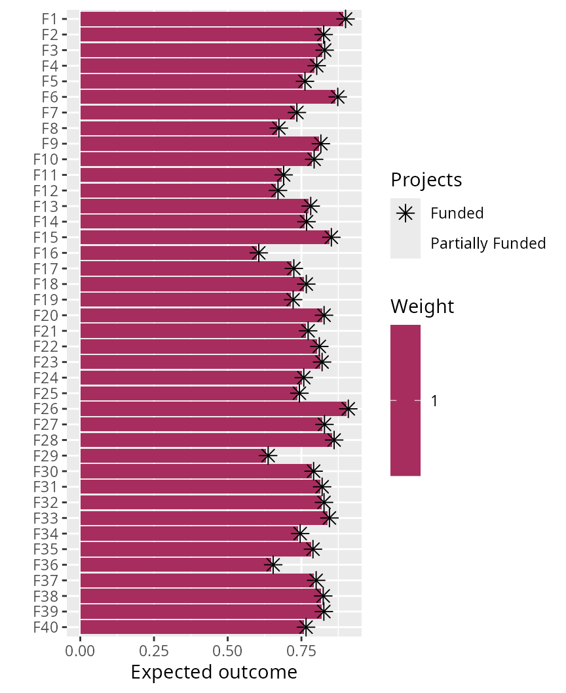

Overall, we can see that most species have a fairly decent chance at
persisting into the future (approx. 77%). But when making this
prioritization, we assumed that we valued the persistence of each
feature equally. It is often important to account for the fact that
certain features are valued more highly than other features when making
prioritizations (e.g. for cultural or taxonomic reasons). The `features`
table that we created earlier contains a `"weight"` column, and features
with larger values mean that they are more important. Let’s quickly
visualize the feature weight values.

``` r
# print features table
print(features)
```

    # # A tibble: 40 × 2
    #    name     weight
    #    <chr>     <dbl>
    #  1 F1       210.  
    #  2 F2         7.64
    #  3 F3         7.99
    #  4 F4      7732.  
    #  5 F5     34905.  
    #  6 F6         3.31
    #  7 F7      1168.  
    #  8 F8    108301.  
    #  9 F9         3.62
    # 10 F10     6956.  
    # # ℹ 30 more rows

``` r

# plot histogram of feature weights
ggplot(data = features, aes(weight)) +
  geom_histogram(bins = 30) +
  scale_x_continuous(labels = scales::comma) +
  xlab("Feature weight") +
  ylab("Frequency")
```

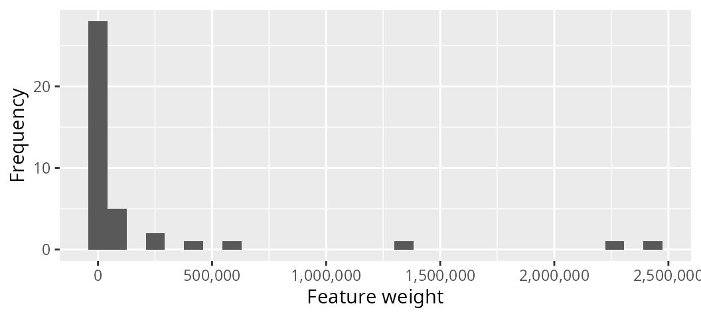

We can see that most features have a low weighting (less than 1,000),
but a few features have very high weightings (greater than 500,000).
Let’s make a new problem based on the original problem, add the feature
weights to the new problem, and then solve this new problem.

``` r
# build on existing problem and add feature weights
p2 <- p1 %>%
  add_feature_weights("weight")

# print problem
print(p2)
```

    # Project Prioritization Problem
    # actions:         action_1, action_2, action_3, ... (31 actions)
    # projects:        project_1, project_2, project_3, ... (71 projects)
    # features:        F1, F2, F3, ... (40 features)
    # action costs:    continuous values (between 0 and 113.35)
    # project success: proportion values (between 0.702 and 1)
    # objective:       maximum richness objective
    # targets:         none specified
    # weights:         feature weights
    # constraints:     none specified
    # decisions:       binary decision
    # solver:          none specified

``` r
# solve problem
s2 <- solve(p2)
```

``` r
# print solution
print(s2)
```

    # # A tibble: 1 × 146
    #   solution status   cost      obj action_1 action_2 action_3 action_4 action_5
    #      <int> <chr>   <dbl>    <dbl>    <dbl>    <dbl>    <dbl>    <dbl>    <dbl>
    # 1        1 OPTIMAL  977. 6290606.        0        1        1        0        0
    # # ℹ 137 more variables: action_6 <dbl>, action_7 <dbl>, action_8 <dbl>,
    # #   action_9 <dbl>, action_10 <dbl>, action_11 <dbl>, action_12 <dbl>,
    # #   action_13 <dbl>, action_14 <dbl>, action_15 <dbl>, action_16 <dbl>,
    # #   action_17 <dbl>, action_18 <dbl>, action_19 <dbl>, action_20 <dbl>,
    # #   action_21 <dbl>, action_22 <dbl>, action_23 <dbl>, action_24 <dbl>,
    # #   action_25 <dbl>, action_26 <dbl>, action_27 <dbl>, action_28 <dbl>,
    # #   action_29 <dbl>, action_30 <dbl>, baseline_action <dbl>, project_1 <lgl>, …

``` r
# plot solution
plot(p2, s2)
```

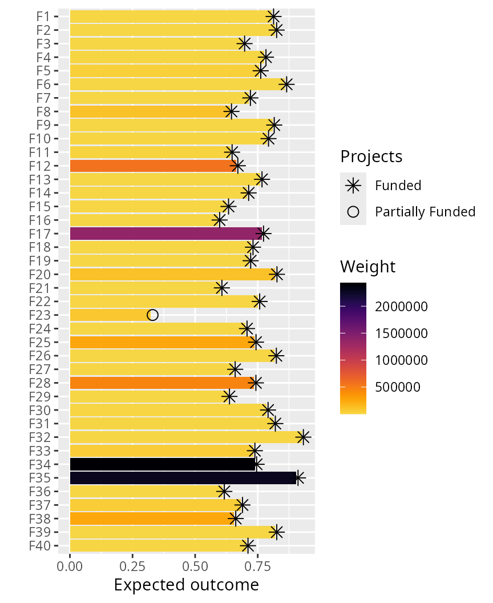

We can also examine how adding feature weights changed our solution.

``` r
# print actions prioritized for funding in first solution
actions$name[which(as.logical(as.matrix(s1[, action_names(p1)])))]
```

    #  [1] "action_1"  "action_2"  "action_10" "action_14" "action_21" "action_22"
    #  [7] "action_26" "action_27" "action_28" "action_30"

``` r

# print actions prioritized for funding in second solution
actions$name[which(as.logical(as.matrix(s2[, action_names(p2)])))]
```

    #  [1] "action_2"        "action_3"        "action_8"        "action_14"      
    #  [5] "action_17"       "action_19"       "action_22"       "action_27"      
    #  [9] "action_28"       "action_29"       "baseline_action"

``` r

# calculate number of actions funded in both solutions
sum((as.matrix(s1[, action_names(p1)]) == 1) &
  (as.matrix(s2[, action_names(p2)]) == 1))
```

    # [1] 5

Earlier, we talked about the *oppr R* package using the default exact
algorithm solver. Although you should have the *lpSolveAPI* solver
automatically installed, we strongly recommend installing the [*gurobi
R*
package](https://support.gurobi.com/hc/en-us/articles/14462206790033-How-do-I-install-Gurobi-for-R)
and the [Gurobi optimization suite](https://www.gurobi.com/). This is
because Gurobi can solve optimization problems much faster than any
other software currently supported and it can also easily generate
multiple solutions. Unfortunately, you will have to install Gurobi
manually, but please see the documentation for the solver for
instructions (i.e. enter the command
[`?add_gurobi_solver`](https://prioritizr.github.io/oppr/reference/add_gurobi_solver.md)
into the console). If you have Gurobi installed, let’s try using the
Gurobi solver to generate multiple solutions. Here, we will manually
specify the Gurobi solver and request 1,000 solutions (though we will
probably obtain less than 1,000 solutions, so if we actually wanted
1,000 solutions then we would need to specify a much larger number).

``` r
# create new problem, with Gurobi solver added and request multiple solutions
# note that we set the gap to 0.5 because we are not necessarily interested
# in the top 1,000 solutions (for more information on why read the Gurobi
# documentation on solution pools)
p3 <- p2 %>%
  add_gurobi_solver(gap = 0.5, number_solution = 1000)
```

``` r
# solve problem
s3 <- solve(p3)
```

``` r
# print solution
print(s3)
```

    # # A tibble: 28 × 146
    #    solution status   cost      obj action_1 action_2 action_3 action_4 action_5
    #       <int> <chr>   <dbl>    <dbl>    <dbl>    <dbl>    <dbl>    <dbl>    <dbl>
    #  1        1 OPTIMAL  977. 6290606.        0        1        1        0        0
    #  2        2 OPTIMAL  974. 6290606.        0        1        1        0        0
    #  3        3 OPTIMAL  967. 6290606.        0        1        1        0        0
    #  4        4 OPTIMAL  977. 6290606.        0        1        1        1        0
    #  5        5 OPTIMAL  977. 6290606.        0        1        1        0        0
    #  6        6 OPTIMAL  874. 6290606.        0        1        1        0        0
    #  7        7 OPTIMAL  970. 6290606.        0        1        1        0        1
    #  8        8 OPTIMAL  971. 6290606.        0        1        1        0        0
    #  9        9 OPTIMAL  969. 6290606.        0        1        1        0        0
    # 10       10 OPTIMAL  980. 6290606.        0        1        1        0        0
    # # ℹ 18 more rows
    # # ℹ 137 more variables: action_6 <dbl>, action_7 <dbl>, action_8 <dbl>,
    # #   action_9 <dbl>, action_10 <dbl>, action_11 <dbl>, action_12 <dbl>,
    # #   action_13 <dbl>, action_14 <dbl>, action_15 <dbl>, action_16 <dbl>,
    # #   action_17 <dbl>, action_18 <dbl>, action_19 <dbl>, action_20 <dbl>,
    # #   action_21 <dbl>, action_22 <dbl>, action_23 <dbl>, action_24 <dbl>,
    # #   action_25 <dbl>, action_26 <dbl>, action_27 <dbl>, action_28 <dbl>, …

We obtained 28 solutions. Let’s briefly explore them.

``` r
# plot histogram of objective values, and add red dashed line to indicate the
# objective value for the optimal solution
ggplot(data = s3, aes(obj)) +
  geom_histogram(bins = 10) +
  geom_vline(xintercept = s2$obj, color = "red", linetype = "dashed") +
  scale_x_continuous(labels = scales::comma) +
  xlab("Expected richness (objective function)") +
  ylab("Frequency") +
  theme(plot.margin = unit(c(5.5, 10.5, 5.5, 5.5), "pt"))
```

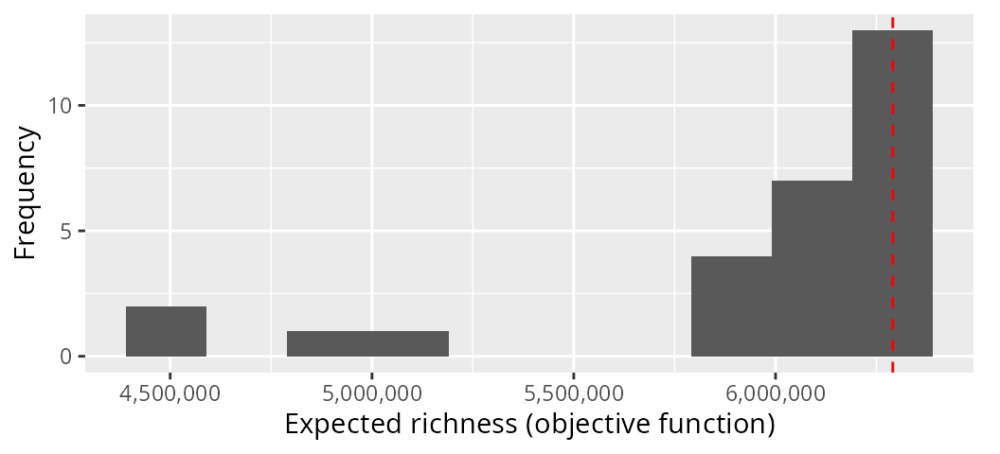

We can see that some of our solutions performed much better than other
solutions. And we can also see that there are several solutions that
perform nearly as well as the optimal solution.

### Assessing action importance

After obtaining a solution to a project prioritization problem, it is
often important to understand which of priority actions are most
“important” \[or in other words: irreplaceable; Kukkala & Moilanen
(2013)\]. This is because it may not be possible to implement all
actions immediately and simultaneously, and since some conservation
projects may be less likely to succeed if their management actions are
delayed, it may be useful to provide decision makers with a measure of
importance for each priority action. For example, if a pest eradication
project is delayed, then the success of the project may diminish as pest
populations increase over time. One simple—and potentially inaccurate
(but see Carwardine *et al.* 2007)—approach for assessing the importance
of priority actions (i.e. actions selected for funding in a solution) is
calculating the “selection frequency” of the actions. Given multiple
solutions, this metric involves calculating the average number of times
that each priority action is selected (Ball *et al.* 2009). For
illustrative purposes, we shall compute the selection frequency of the
solutions we obtained previously (i.e. the `s3` object).

``` r
# print the solution object to remind ourselves what it looks like
print(s3)
```

    # # A tibble: 28 × 146
    #    solution status   cost      obj action_1 action_2 action_3 action_4 action_5
    #       <int> <chr>   <dbl>    <dbl>    <dbl>    <dbl>    <dbl>    <dbl>    <dbl>
    #  1        1 OPTIMAL  977. 6290606.        0        1        1        0        0
    #  2        2 OPTIMAL  974. 6290606.        0        1        1        0        0
    #  3        3 OPTIMAL  967. 6290606.        0        1        1        0        0
    #  4        4 OPTIMAL  977. 6290606.        0        1        1        1        0
    #  5        5 OPTIMAL  977. 6290606.        0        1        1        0        0
    #  6        6 OPTIMAL  874. 6290606.        0        1        1        0        0
    #  7        7 OPTIMAL  970. 6290606.        0        1        1        0        1
    #  8        8 OPTIMAL  971. 6290606.        0        1        1        0        0
    #  9        9 OPTIMAL  969. 6290606.        0        1        1        0        0
    # 10       10 OPTIMAL  980. 6290606.        0        1        1        0        0
    # # ℹ 18 more rows
    # # ℹ 137 more variables: action_6 <dbl>, action_7 <dbl>, action_8 <dbl>,
    # #   action_9 <dbl>, action_10 <dbl>, action_11 <dbl>, action_12 <dbl>,
    # #   action_13 <dbl>, action_14 <dbl>, action_15 <dbl>, action_16 <dbl>,
    # #   action_17 <dbl>, action_18 <dbl>, action_19 <dbl>, action_20 <dbl>,
    # #   action_21 <dbl>, action_22 <dbl>, action_23 <dbl>, action_24 <dbl>,
    # #   action_25 <dbl>, action_26 <dbl>, action_27 <dbl>, action_28 <dbl>, …

``` r

# calculate percentage of times each action was selected for
# funding in the solutions
actions$sel_freq <- apply(as.matrix(s3[, actions$name]), 2, mean) * 100

# print the actions table with the new column
print(actions)
```

    # # A tibble: 31 × 5
    #    name       cost locked_in locked_out sel_freq
    #    <chr>     <dbl> <lgl>     <lgl>         <dbl>
    #  1 action_1   97.8 FALSE     FALSE         21.4 
    #  2 action_2   94.0 FALSE     FALSE         71.4 
    #  3 action_3  100.  FALSE     FALSE         64.3 
    #  4 action_4  103.  FALSE     FALSE          7.14
    #  5 action_5   96.1 FALSE     FALSE          7.14
    #  6 action_6   98.1 FALSE     FALSE          0   
    #  7 action_7   97.6 FALSE     FALSE         10.7 
    #  8 action_8  104.  FALSE     FALSE          7.14
    #  9 action_9   99.9 FALSE     FALSE          3.57
    # 10 action_10  93.1 FALSE     FALSE         35.7 
    # # ℹ 21 more rows

``` r

# print top 10 most important actions based on selection frequency
head(actions[order(actions$sel_freq, decreasing = TRUE), ], n = 10)
```

    # # A tibble: 10 × 5
    #    name             cost locked_in locked_out sel_freq
    #    <chr>           <dbl> <lgl>     <lgl>         <dbl>
    #  1 action_14        99.4 FALSE     FALSE          96.4
    #  2 baseline_action   0   FALSE     FALSE          96.4
    #  3 action_28       102.  FALSE     FALSE          89.3
    #  4 action_22        93.9 FALSE     FALSE          78.6
    #  5 action_27        91.1 FALSE     FALSE          78.6
    #  6 action_19        89.8 FALSE     FALSE          75  
    #  7 action_2         94.0 FALSE     FALSE          71.4
    #  8 action_29       103.  FALSE     FALSE          71.4
    #  9 action_17       101.  FALSE     FALSE          67.9
    # 10 action_3        100.  FALSE     FALSE          64.3

``` r

# plot histogram showing solution frequency
ggplot(data = actions, aes(sel_freq)) +
  geom_histogram(bins = 30) +
  coord_cartesian(xlim = c(0, 100)) +
  xlab("Selection frequency (%)") +
  ylab("Frequency")
```

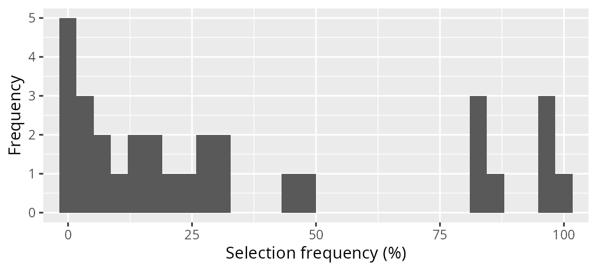

Although selection frequency might seem like an appealing metric, it
suffers from an assumption that is unrealistic for most large-scale
problems. Specifically, it assumes that our portfolio of solutions is a
representative sample of the near-optimal solutions to the problem. And
we do not currently have any method to verify this, except by
enumerating all possible solutions—which is not feasible for reasonably
sized project prioritization exercises. So now we shall examine a
superior metric termed the “replacement cost” (Moilanen *et al.* 2009).
Given a set of priority actions and a project prioritization problem,
the replacement cost can be calculated for a given priority action by
re-solving the problem with the priority action locked out, and
calculating the difference between the objective value based on the
priority actions and the new objective value with the priority action
locked out. So let’s calculate the replacement cost for the priority
actions in object `s2` using the problem `p2`.

``` r
# print p2 to remind ourselves about the problem
print(p2)
```

    # Project Prioritization Problem
    # actions:         action_1, action_2, action_3, ... (31 actions)
    # projects:        project_1, project_2, project_3, ... (71 projects)
    # features:        F1, F2, F3, ... (40 features)
    # action costs:    continuous values (between 0 and 113.35)
    # project success: proportion values (between 0.702 and 1)
    # objective:       maximum richness objective
    # targets:         none specified
    # weights:         feature weights
    # constraints:     none specified
    # decisions:       binary decision
    # solver:          none specified

``` r

# print s2 to remind ourselves about the solution
print(s2)
```

    # # A tibble: 1 × 146
    #   solution status   cost      obj action_1 action_2 action_3 action_4 action_5
    #      <int> <chr>   <dbl>    <dbl>    <dbl>    <dbl>    <dbl>    <dbl>    <dbl>
    # 1        1 OPTIMAL  977. 6290606.        0        1        1        0        0
    # # ℹ 137 more variables: action_6 <dbl>, action_7 <dbl>, action_8 <dbl>,
    # #   action_9 <dbl>, action_10 <dbl>, action_11 <dbl>, action_12 <dbl>,
    # #   action_13 <dbl>, action_14 <dbl>, action_15 <dbl>, action_16 <dbl>,
    # #   action_17 <dbl>, action_18 <dbl>, action_19 <dbl>, action_20 <dbl>,
    # #   action_21 <dbl>, action_22 <dbl>, action_23 <dbl>, action_24 <dbl>,
    # #   action_25 <dbl>, action_26 <dbl>, action_27 <dbl>, action_28 <dbl>,
    # #   action_29 <dbl>, action_30 <dbl>, baseline_action <dbl>, project_1 <lgl>, …

``` r

# calculate replacement costs for each priority action selected in s2
r2 <- replacement_costs(p2, s2)

# print output
print(r2)
```

    # # A tibble: 31 × 4
    #    name       cost      obj rep_cost
    #    <chr>     <dbl>    <dbl>    <dbl>
    #  1 action_1    NA       NA       NA 
    #  2 action_2   988. 6102909.  187698.
    #  3 action_3   993. 6122986.  167620.
    #  4 action_4    NA       NA       NA 
    #  5 action_5    NA       NA       NA 
    #  6 action_6    NA       NA       NA 
    #  7 action_7    NA       NA       NA 
    #  8 action_8   980. 6290606.       0 
    #  9 action_9    NA       NA       NA 
    # 10 action_10   NA       NA       NA 
    # # ℹ 21 more rows

The `r1` table contains the replacement costs for each action and also
various statistics associated with the solutions obtained when locking
out each action. Here, each row corresponds to a different action. The
`"action"` column contains the name of the actions (as per the `actions`
table used when building the problem), the `"cost"` column contains the
cost of the solutions obtained when each action was locked out, the
`"obj"` column contains the objective value of the solutions when each
action was locked out (i.e. the expected feature richness in this case),
and the `"rep_cost"` column contains the replacement costs for the
actions. Actions associated with larger replacement cost values are more
irreplaceable, actions associated with missing (`NA`) replacement cost
values were not selected for funding in the input solution (i.e. `s2`),
and actions associated with infinite (`Inf`) replacement cost values are
absolutely critical for meeting the constraints (though infinite values
should only problems with minimum set objectives and potentially the
baseline project).

``` r
# add replacement costs to action table
actions$rep_cost <- r2$rep_cost

# print actions, ordered by replacement cost
print(actions[order(actions$rep_cost, decreasing = TRUE), ])
```

    # # A tibble: 31 × 6
    #    name             cost locked_in locked_out sel_freq rep_cost
    #    <chr>           <dbl> <lgl>     <lgl>         <dbl>    <dbl>
    #  1 action_14        99.4 FALSE     FALSE          96.4  345636.
    #  2 action_2         94.0 FALSE     FALSE          71.4  187698.
    #  3 action_22        93.9 FALSE     FALSE          78.6  187698.
    #  4 action_3        100.  FALSE     FALSE          64.3  167620.
    #  5 action_17       101.  FALSE     FALSE          67.9  167620.
    #  6 action_19        89.8 FALSE     FALSE          75    167620.
    #  7 action_27        91.1 FALSE     FALSE          78.6  167620.
    #  8 action_28       102.  FALSE     FALSE          89.3  167620.
    #  9 action_29       103.  FALSE     FALSE          71.4  167620.
    # 10 baseline_action   0   FALSE     FALSE          96.4  167620.
    # # ℹ 21 more rows

``` r

# test correlation between selection frequencies and replacement costs
cor.test(x = actions$sel_freq, y = actions$rep_cost, method = "pearson")
```

    # 
    #  Pearson's product-moment correlation
    # 
    # data:  actions$sel_freq and actions$rep_cost
    # t = 4.2029, df = 9, p-value = 0.002297
    # alternative hypothesis: true correlation is not equal to 0
    # 95 percent confidence interval:
    #  0.4182619 0.9499714
    # sample estimates:
    #       cor 
    # 0.8139204

``` r

# plot histogram of replacement costs,
ggplot(data = actions, aes(rep_cost)) +
  geom_histogram(bins = 30, na.rm = TRUE) +
  scale_x_continuous(labels = scales::comma) +
  xlab("Replacement cost") +
  ylab("Frequency")
```

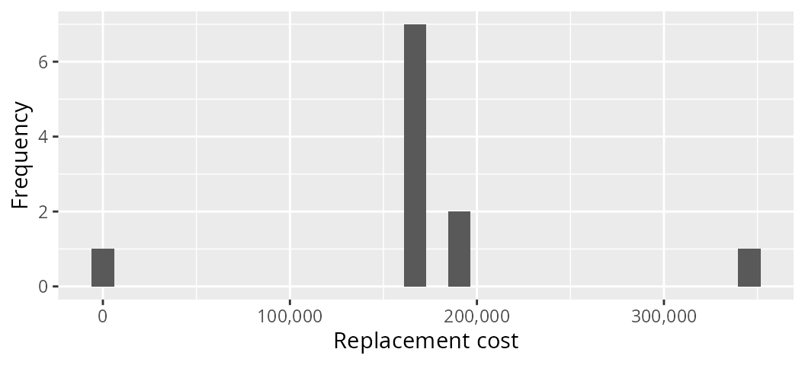

### Complementarity in project prioritizations

Broadly speaking, the principle of complementarity is that individual
conservation actions should complement each other—in other words, they
should not double up on the same biodiversity features—and when
implemented together, conservation actions should conserve a
comprehensive sample of biodiversity (Vane-Wright *et al.* 1991; Kukkala
& Moilanen 2013). This principle was born from the profound realization
that individual reserves need to provide habitat for different species
in order to build a reserve network that provides habitat for many
different species—even if this means selecting some individual reserves
that do not provide habitat for as many species as other potential
reserves (Kirkpatrick 1983). In the context of project prioritization,
this principle means that resources should be allocated in such a way
that avoids doubling up on the same conservation features so that
resources can be effectively allocated to as many conservation features
as possible (Chadés *et al.* 2015). For instance, if decision makers
consider it acceptable for features to have a 70% chance of persisting
into the future, then we should avoid solutions which overly surpass
this threshold (e.g. 99%) because we can allocate the limited resources
to help other features reach this threshold. Such target thresholds can
provide a transparent and effective method for establishing conservation
priorities (Carwardine *et al.* 2009). So, let’s try developing a
prioritization with conservation targets. Specifically, we will develop
a prioritization that maximizes the number of features that have a 60%
chance of persisting, subject to the same \$1,000 budget as before.

``` r
# build problem
p4 <- problem(
  projects = projects, actions = actions, features = features,
  "name", "success", "name", "cost", "name"
) %>%
  add_max_targets_met_objective(budget = 1000) %>%
  add_absolute_targets(0.7) %>%
  add_binary_decisions()

# print problem
print(p4)
```

    # Project Prioritization Problem
    # actions:         action_1, action_2, action_3, ... (31 actions)
    # projects:        project_1, project_2, project_3, ... (71 projects)
    # features:        F1, F2, F3, ... (40 features)
    # action costs:    continuous values (between 0 and 113.35)
    # project success: proportion values (between 0.702 and 1)
    # objective:       maximum targets met objective
    # targets:         absolute targets
    # weights:         none specified
    # constraints:     none specified
    # decisions:       binary decision
    # solver:          none specified

``` r
# solve problem
s4 <- solve(p4)
```

``` r
# print solution
print(s4)
```

    # # A tibble: 1 × 146
    #   solution status   cost   obj action_1 action_2 action_3 action_4 action_5
    #      <int> <chr>   <dbl> <dbl>    <dbl>    <dbl>    <dbl>    <dbl>    <dbl>
    # 1        1 OPTIMAL  993.    36        1        1        0        0        0
    # # ℹ 137 more variables: action_6 <dbl>, action_7 <dbl>, action_8 <dbl>,
    # #   action_9 <dbl>, action_10 <dbl>, action_11 <dbl>, action_12 <dbl>,
    # #   action_13 <dbl>, action_14 <dbl>, action_15 <dbl>, action_16 <dbl>,
    # #   action_17 <dbl>, action_18 <dbl>, action_19 <dbl>, action_20 <dbl>,
    # #   action_21 <dbl>, action_22 <dbl>, action_23 <dbl>, action_24 <dbl>,
    # #   action_25 <dbl>, action_26 <dbl>, action_27 <dbl>, action_28 <dbl>,
    # #   action_29 <dbl>, action_30 <dbl>, baseline_action <dbl>, project_1 <lgl>, …

``` r

# plot solution
plot(p4, s4)
```

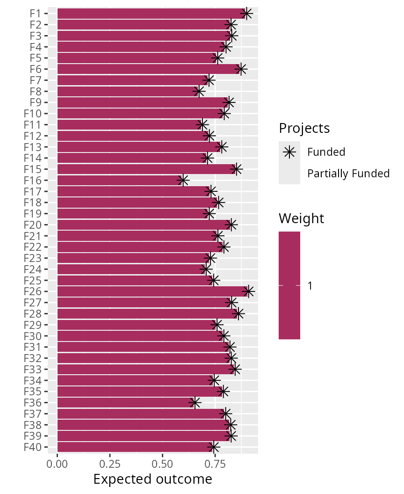

But how would the number of features which meet the target change if we
increased the budget? Or how would the number of features which meet the
target change if we increased the target to 85%? These are common
questions in project prioritization exercises (e.g. Chadés *et al.*
2015; Di Fonzo *et al.* 2016; Martin *et al.* 2018). So, let’s try
solving this problem with 70% and 85% targets under a range of different
budgets and plot the relationships.

``` r
# specify budgets, ranging between zero and the total cost of all the budgets,
# with the total number of different budgets equaling 50
# (note that we would use a higher number for publications)
budgets <- seq(0, sum(actions$cost), length.out = 50)

# specify targets
targets <- c(0.7, 0.85)

# run prioritizations and compile results
comp_data <- lapply(targets, function(i) {
  o <- lapply(budgets, function(b) {
    problem(
      projects = projects, actions = actions, features = features,
      "name", "success", "name", "cost", "name"
    ) %>%
      add_max_targets_met_objective(budget = b) %>%
      add_absolute_targets(i) %>%
      add_binary_decisions() %>%
      add_default_solver(verbose = FALSE) %>%
      solve()
  })
  o <- as_tibble(do.call(rbind, o))
  o$budget <- budgets
  o$target <- paste0(i * 100, "%")
  o
})
comp_data <- as_tibble(do.call(rbind, comp_data))

# plot the relationship between the number of features that meet the target
# in a solution and the cost of a solution
ggplot(comp_data, aes(x = cost, y = obj, color = target)) +
  geom_step() +
  xlab("Solution cost ($)") +
  ylab("Number of features with targets") +
  labs(color = "Target")
```

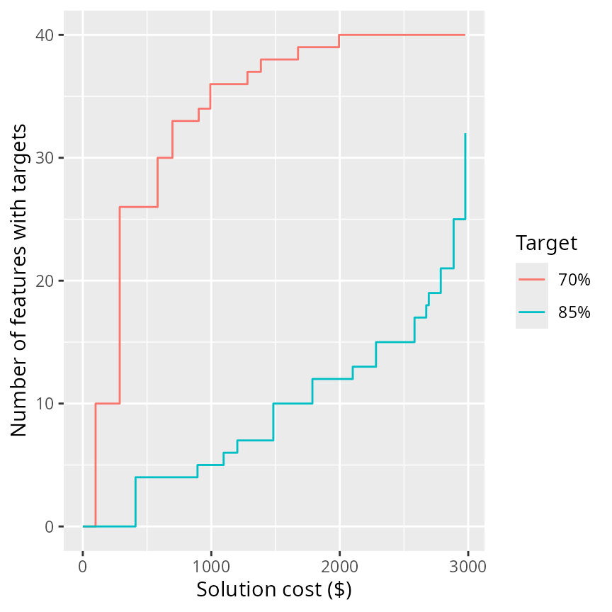

We might also be interested in understanding how exactly how much it
would cost to implement a set of management actions that would result in
all of the features meeting a specific target. Let’s see if we can find
out how much it would cost to ensure that every feature has a 99%
probability of persistence.

``` r
# build problem
p5 <- problem(
  projects = projects, actions = actions, features = features,
  "name", "success", "name", "cost", "name"
) %>%
  add_min_set_objective() %>%
  add_absolute_targets(0.99) %>%
  add_binary_decisions()

# print problem
print(p5)
```

    # Project Prioritization Problem
    # actions:         action_1, action_2, action_3, ... (31 actions)
    # projects:        project_1, project_2, project_3, ... (71 projects)
    # features:        F1, F2, F3, ... (40 features)
    # action costs:    continuous values (between 0 and 113.35)
    # project success: proportion values (between 0.702 and 1)
    # objective:       minimum set objective
    # targets:         absolute targets
    # weights:         none specified
    # constraints:     none specified
    # decisions:       binary decision
    # solver:          none specified

``` r
# attempt to solve problem, but this will throw an error
s5 <- solve(p5)
```

    # Set parameter Username
    # Set parameter LicenseID to value 2738655
    # Set parameter TimeLimit to value 2147483647
    # Set parameter MIPGap to value 0
    # Set parameter NumericFocus to value 2
    # Set parameter Presolve to value 2
    # Set parameter Threads to value 1
    # Set parameter PoolSolutions to value 1
    # Set parameter PoolSearchMode to value 2
    # Academic license - for non-commercial use only - expires 2026-11-14
    # Gurobi Optimizer version 13.0.0 build v13.0.0rc1 (linux64 - "Ubuntu 24.04.2 LTS")
    # 
    # CPU model: 11th Gen Intel(R) Core(TM) i7-1185G7 @ 3.00GHz, instruction set [SSE2|AVX|AVX2|AVX512]
    # Thread count: 4 physical cores, 8 logical processors, using up to 1 threads
    # 
    # Non-default parameters:
    # TimeLimit  2147483647
    # MIPGap  0
    # NumericFocus  2
    # Presolve  2
    # Threads  1
    # PoolSolutions  1
    # PoolSearchMode  2
    # 
    # Optimize a model with 2585 rows, 1459 columns and 7724 nonzeros (Min)
    # Model fingerprint: 0x1c973b18
    # Model has 30 linear objective coefficients
    # Variable types: 0 continuous, 1459 integer (1459 binary)
    # Coefficient statistics:
    #   Matrix range     [8e-02, 1e+00]
    #   Objective range  [9e+01, 1e+02]
    #   Bounds range     [1e+00, 1e+00]
    #   RHS range        [1e+00, 1e+00]
    # Presolve time: 0.00s
    # 
    # Explored 0 nodes (0 simplex iterations) in 0.00 seconds (0.00 work units)
    # Thread count was 1 (of 8 available processors)
    # 
    # Solution count 0
    # 
    # Model is infeasible
    # Best objective -, best bound -, gap -

    # Error in `solve()`:
    # ! project prioritization problem is infeasible

We received an error instead of a solution. If we read the error
message, then we can see that it is telling us—perhaps rather
tersely—that there are no valid solutions to the problem (i.e. the
problem is infeasible), because some features simply cannot obtain an
99% probability of persistence given the range of conservation projects
that are available. So, let’s see how much it would cost to ensure that
every feature has a 60% chance of persistence.

``` r
# build problem
p6 <- problem(
  projects = projects, actions = actions, features = features,
  "name", "success", "name", "cost", "name"
) %>%
  add_min_set_objective() %>%
  add_absolute_targets(0.60) %>%
  add_binary_decisions()

# print problem
print(p6)
```

    # Project Prioritization Problem
    # actions:         action_1, action_2, action_3, ... (31 actions)
    # projects:        project_1, project_2, project_3, ... (71 projects)
    # features:        F1, F2, F3, ... (40 features)
    # action costs:    continuous values (between 0 and 113.35)
    # project success: proportion values (between 0.702 and 1)
    # objective:       minimum set objective
    # targets:         absolute targets
    # weights:         none specified
    # constraints:     none specified
    # decisions:       binary decision
    # solver:          none specified

``` r
# solve problem
s6 <- solve(p6)
```

``` r
# print solution
print(s6)
```

    # # A tibble: 1 × 146
    #   solution status   cost   obj action_1 action_2 action_3 action_4 action_5
    #      <int> <chr>   <dbl> <dbl>    <dbl>    <dbl>    <dbl>    <dbl>    <dbl>
    # 1        1 OPTIMAL  972.  972.        0        1        0        0        0
    # # ℹ 137 more variables: action_6 <dbl>, action_7 <dbl>, action_8 <dbl>,
    # #   action_9 <dbl>, action_10 <dbl>, action_11 <dbl>, action_12 <dbl>,
    # #   action_13 <dbl>, action_14 <dbl>, action_15 <dbl>, action_16 <dbl>,
    # #   action_17 <dbl>, action_18 <dbl>, action_19 <dbl>, action_20 <dbl>,
    # #   action_21 <dbl>, action_22 <dbl>, action_23 <dbl>, action_24 <dbl>,
    # #   action_25 <dbl>, action_26 <dbl>, action_27 <dbl>, action_28 <dbl>,
    # #   action_29 <dbl>, action_30 <dbl>, baseline_action <dbl>, project_1 <lgl>, …

``` r
# plot solution
plot(p6, s6)
```

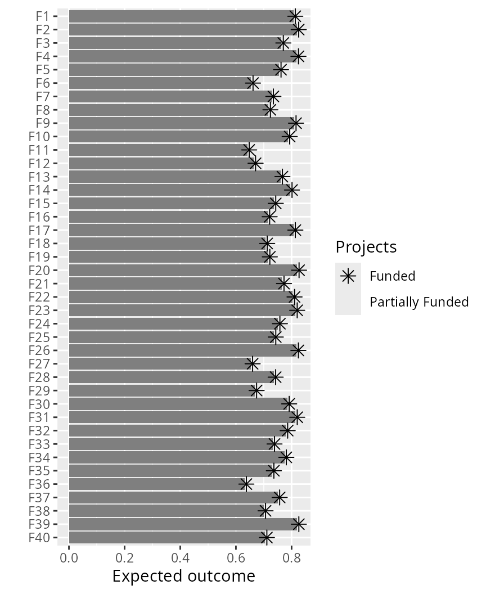

### Benchmarking conventional algorithms

Conventionally, heuristic algorithms have been used to develop project
prioritizations (e.g. Joseph *et al.* 2009; Bennett *et al.* 2014).
Although solutions identified using these algorithms often perform
better than solutions generated using using random processes
\[e.g. randomly selecting actions for funding until a budget is met;
Joseph *et al.* (2009)\], this is not an especially compelling
benchmark. As talked about earlier, heuristic algorithms do not provide
any guarantees on solution quality, and so should be avoided where
possible (Rodrigues & Gaston 2002). To illustrate the pitfalls of
relying on heuristic algorithms, let’s generate a portfolio of solutions
using a backwards heuristic algorithm.

``` r
# set budgets for which to create multiple solutions
budgets <- seq(0, sum(actions$cost), length.out = 100)

# generate solutions using heuristic algorithms
s7 <- lapply(budgets, function(b) {
  problem(
    projects = projects, actions = actions, features = features,
    "name", "success", "name", "cost", "name"
  ) %>%
    add_max_richness_objective(budget = b) %>%
    add_feature_weights("weight") %>%
    add_binary_decisions() %>%
    add_heuristic_solver(verbose = FALSE) %>%
    solve()
})
s7 <- as_tibble(do.call(rbind, s7))
s7$budget <- budgets

# print solutions
print(s7)
```

    # # A tibble: 100 × 147
    #    solution status  cost      obj action_1 action_2 action_3 action_4 action_5
    #       <int> <chr>  <dbl>    <dbl>    <dbl>    <dbl>    <dbl>    <dbl>    <dbl>
    #  1        1 NA       0   2284593.        0        0        0        0        0
    #  2        1 NA       0   2284593.        0        0        0        0        0
    #  3        1 NA       0   2284593.        0        0        0        0        0
    #  4        1 NA       0   2284593.        0        0        0        0        0
    #  5        1 NA      99.4 4513353.        0        0        0        0        0
    #  6        1 NA      99.4 4513353.        0        0        0        0        0
    #  7        1 NA      99.4 4513353.        0        0        0        0        0
    #  8        1 NA      99.4 4513353.        0        0        0        0        0
    #  9        1 NA      99.4 4513353.        0        0        0        0        0
    # 10        1 NA      99.4 4513353.        0        0        0        0        0
    # # ℹ 90 more rows
    # # ℹ 138 more variables: action_6 <dbl>, action_7 <dbl>, action_8 <dbl>,
    # #   action_9 <dbl>, action_10 <dbl>, action_11 <dbl>, action_12 <dbl>,
    # #   action_13 <dbl>, action_14 <dbl>, action_15 <dbl>, action_16 <dbl>,
    # #   action_17 <dbl>, action_18 <dbl>, action_19 <dbl>, action_20 <dbl>,
    # #   action_21 <dbl>, action_22 <dbl>, action_23 <dbl>, action_24 <dbl>,
    # #   action_25 <dbl>, action_26 <dbl>, action_27 <dbl>, action_28 <dbl>, …

Now let’s generate a portfolio of solutions using random processes.

``` r
# generate random solutions under the various budgets and store
# the objective value of the best and worst solutions
s8 <- lapply(budgets, function(b) {
  o <- problem(
    projects = projects, actions = actions, features = features,
    "name", "success", "name", "cost", "name"
  ) %>%
    add_max_richness_objective(budget = b) %>%
    add_feature_weights("weight") %>%
    add_binary_decisions() %>%
    add_random_solver(verbose = FALSE, number_solutions = 100) %>%
    solve()
  data.frame(budget = b, min_obj = min(o$obj), max_obj = max(o$obj))
})
s8 <- as_tibble(do.call(rbind, s8))

# print solutions
print(s8)
```

    # # A tibble: 100 × 3
    #    budget  min_obj  max_obj
    #     <dbl>    <dbl>    <dbl>
    #  1    0   2284593. 2284593.
    #  2   30.1 2284593. 2284593.
    #  3   60.1 2284593. 2284593.
    #  4   90.2 2284593. 2284593.
    #  5  120.  4513353. 4513353.
    #  6  150.  4513353. 4513353.
    #  7  180.  4513353. 4513353.
    #  8  211.  2284651. 4513353.
    #  9  241.  2284651. 4513353.
    # 10  271.  2284651. 4513353.
    # # ℹ 90 more rows

Now we can visualize how well the solutions identified using the
heuristic algorithm compare to solutions generated using random
processes. In the plot below, the orange line shows the performance of
solutions generated using the heuristic algorithm, and the blue ribbon
shows the performance of the best and worst solutions generated using
random processes.

``` r
# make plot
ggplot() +
  geom_ribbon(aes(x = budget, ymin = min_obj, ymax = max_obj),
    data = s8,
    color = "#3366FF26", fill = "#3366FF26"
  ) +
  geom_step(aes(x = budget, y = obj), data = s7, color = "orange") +
  scale_x_continuous(labels = scales::comma) +
  scale_y_continuous(labels = scales::comma) +
  xlab("Budget available ($)") +
  ylab("Expected richness (objective function)") +
  theme(axis.text.y = element_text(angle = 90, vjust = 1))
```

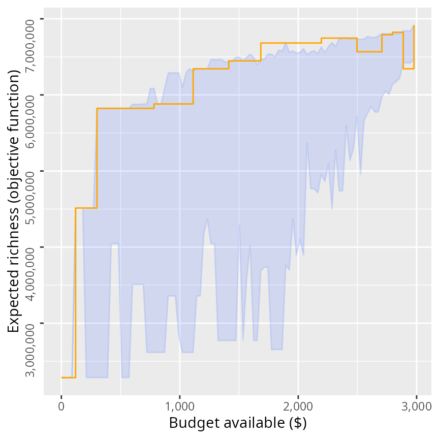

Here, we can see the that heuristic algorithm generally performs better
than funding conservation projects using random processes. We can also
see that for some budgets, the heuristic algorithm returns a worse
solution (i.e. has a lower objective value) then solutions it found for
lower budgets (i.e. where there is a step down in the orange line).
Unfortunately, this behavior is normal because heuristic algorithms
often deliver suboptimal solutions and the degree of suboptimality often
varies depending on the budget. Despite these occasional drops in
solution quality, you might be tempted to think that these results show
that heuristic algorithms can perform pretty well on balance. But we can
do better. Let’s generate a series of solutions using exact algorithms.

``` r
# generate solutions
s9 <- lapply(budgets, function(b) {
  problem(
    projects = projects, actions = actions, features = features,
    "name", "success", "name", "cost", "name"
  ) %>%
    add_max_richness_objective(budget = b) %>%
    add_feature_weights("weight") %>%
    add_binary_decisions() %>%
    add_default_solver(verbose = FALSE) %>%
    solve()
})
s9 <- as_tibble(do.call(rbind, s9))
s9$budget <- budgets

# print solutions
print(s9)
```

    # # A tibble: 100 × 147
    #    solution status   cost      obj action_1 action_2 action_3 action_4 action_5
    #       <int> <chr>   <dbl>    <dbl>    <dbl>    <dbl>    <dbl>    <dbl>    <dbl>
    #  1        1 OPTIMAL   0   2284593.        0        0        0        0        0
    #  2        1 OPTIMAL   0   2284593.        0        0        0        0        0
    #  3        1 OPTIMAL   0   2284593.        0        0        0        0        0
    #  4        1 OPTIMAL   0   2284593.        0        0        0        0        0
    #  5        1 OPTIMAL  99.4 4513353.        0        0        0        0        0
    #  6        1 OPTIMAL  99.4 4513353.        0        0        0        0        0
    #  7        1 OPTIMAL  99.4 4513353.        0        0        0        0        0
    #  8        1 OPTIMAL  99.4 4513353.        0        0        0        0        0
    #  9        1 OPTIMAL  99.4 4513353.        0        0        0        0        0
    # 10        1 OPTIMAL  99.4 4513353.        0        0        0        0        0
    # # ℹ 90 more rows
    # # ℹ 138 more variables: action_6 <dbl>, action_7 <dbl>, action_8 <dbl>,
    # #   action_9 <dbl>, action_10 <dbl>, action_11 <dbl>, action_12 <dbl>,
    # #   action_13 <dbl>, action_14 <dbl>, action_15 <dbl>, action_16 <dbl>,
    # #   action_17 <dbl>, action_18 <dbl>, action_19 <dbl>, action_20 <dbl>,
    # #   action_21 <dbl>, action_22 <dbl>, action_23 <dbl>, action_24 <dbl>,
    # #   action_25 <dbl>, action_26 <dbl>, action_27 <dbl>, action_28 <dbl>, …

Now let’s redraw the previous graph and add a red line to the plot to
represent the solutions generated using the exact algorithm solver.

``` r
# make plot
ggplot() +
  geom_ribbon(aes(x = budget, ymin = min_obj, ymax = max_obj),
    data = s8,
    color = "#3366FF26", fill = "#3366FF26"
  ) +
  geom_step(aes(x = budget, y = obj), data = s7, color = "orange") +
  geom_step(aes(x = budget, y = obj), data = s9, color = "red") +
  scale_x_continuous(labels = scales::comma) +
  scale_y_continuous(labels = scales::comma) +
  xlab("Budget available ($)") +
  ylab("Expected richness (objective function)") +
  theme(axis.text.y = element_text(angle = 90, hjust = 0.5, vjust = 1))
```

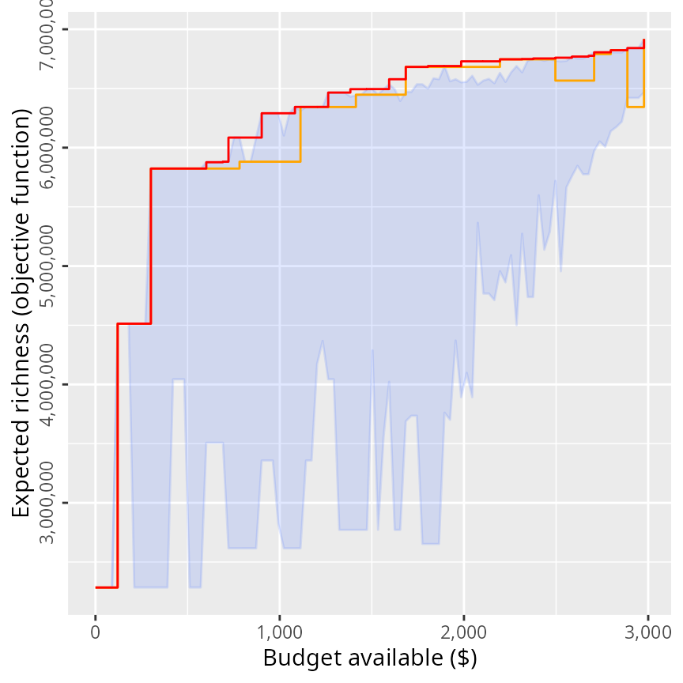

So, we can see that the exact algorithm solver performs much better than
heuristic algorithms—even if heuristic algorithms perform better than
random on average.

### Conclusion

Hopefully, this tutorial has been useful. For more information and
examples on using any of the functions presented in this tutorial,
please refer to this package’s documentation. For instance, you could
learn about the mathematical formulations that underpin the objective
functions (see
[`?add_max_richness_objective`](https://prioritizr.github.io/oppr/reference/add_max_richness_objective.md)),
how to lock in our lock out certain actions from the solutions (see
[`?constraints`](https://prioritizr.github.io/oppr/reference/constraints.md)),
or how to develop project prioritizations using phylogenies (see
`?add_max_phylo_objective`). But perhaps one of the best ways to learn
how to use a new piece of software is to just try it out. Test it, try
breaking it, make mistakes, and learn from them. We would recommend
generating project prioritizations using simulated datasets (see
[`?simulate_ptm_data`](https://prioritizr.github.io/oppr/reference/simulate_ptm_data.md)
and
[`?simulate_ppp_data`](https://prioritizr.github.io/oppr/reference/simulate_ppp_data.md))
and seeing if the solutions line up with what you expect. This way you
can quickly verify that the problems you build actually mean what you
think they mean. For instance, you can try playing around with the
targets and see what effect they have on the solutions, or try playing
around with weights and see what effect they have on the solutions.

Finally, if you have any questions about using the *oppr R* package or
suggestions for improving its documentation or functionality (especially
this tutorial), please post an issue on this package’s online coding
repository (<https://github.com/prioritizr/oppr/issues>).

## Citation

    To cite the oppr package in publications, please use:

      Hanson JO, Schuster R, Strimas-Mackey M & Bennett JR (2019)
      Optimality in prioritizing conservation projects. Methods in Ecology
      & Evolution, 10: 1655--1663.

      Hanson JO, Schuster R, Strimas-Mackey M, Bennett J (2026) oppr:
      Optimal Project Prioritization R package version 1.1.0.
      https://CRAN.R-project.org/package=oppr

    To see these entries in BibTeX format, use 'print(<citation>,
    bibtex=TRUE)', 'toBibtex(.)', or set
    'options(citation.bibtex.max=999)'.

## References

Ball, I.R., Possingham, H.P. & Watts, M. (2009). Marxan and relatives:
Software for spatial conservation prioritisation. *Spatial conservation
prioritisation: Quantitative methods and computational tools*, pp.
185–195. Oxford University Press Oxford.

Bennett, J.R., Elliott, G., Mellish, B., Joseph, L.N., Tulloch, A.I.,
Probert, W.J., Di Fonzo, M.M., Monks, J.M., Possingham, H.P. & Maloney,
R. (2014). Balancing phylogenetic diversity and species numbers in
conservation prioritizat, using a case study of threatened species in
New Zealand. *Biological Conservation*, *174*, 47–54.

Beyer, H.L., Dujardin, Y., Watts, M.E. & Possingham, H.P. (2016).
Solving conservation planning problems with integer linear programming.
*Ecological Modelling*, *328*, 14–22.

Carwardine, J., Klein, C.J., Wilson, K.A., Pressey, R.L. & Possingham,
H.P. (2009). Hitting the target and missing the point: Target-based
conservation planning in context. *Conservation Letters*, *2*, 4–11.

Carwardine, J., Martin, T.G., Firn, J., Reyes, R.P., Nicol, S., Reeson,
A., Grantham, H.S., Stratford, D., Kehoe, L. & Chadès, I. (2018).
Priority Threat Management for biodiversity conservation: A handbook.
*Journal of Applied Ecology*, *In press*, DOI: 10.1111/1365–2664.13268.

Carwardine, J., Rochester, W., Richardson, K., Williams, K.J., Pressey,
R. & Possingham, H. (2007). Conservation planning with irreplaceability:
Does the method matter? *Biodiversity and Conservation*, *16*, 245–258.

Chadés, I., Nicol, S., Leeuwen, S. van, Walters, B., Firn, J., Reeson,
A., Martin, T.G. & Carwardine, J. (2015). Benefits of integrating
complementarity into priority threat management. *Conservation Biology*,
*29*, 525–536.

Di Fonzo, M.M., Possingham, H.P., Probert, W.J., Bennett, J.R., Joseph,
L.N., Tulloch, A.I., O’Connor, S., Densem, J. & Maloney, R.F. (2016).
Evaluating trade-offs between target persistence levels and numbers of
species conserved. *Conservation Letters*, *9*, 51–57.

Gerber, L.R., Runge, M.C., Maloney, R.F., Iacona, G.D., Drew, C.A.,
Avery-Gomm, S., Brazill-Boast, J., Crouse, D., Epanchin-Niell, R.S.,
Hall, S.B. & others. (2018). Endangered species recovery: A resource
allocation problem. *Science*, *362*, 284–286.

Joseph, L.N., Maloney, R.F. & Possingham, H.P. (2009). Optimal
allocation of resources among threatened species: A project
prioritization protocol. *Conservation Biology*, *23*, 328–338.

Kirkpatrick, J. (1983). An iterative method for establishing priorities
for the selection of nature reserves: An example from tasmania.
*Biological Conservation*, *25*, 127–134.

Kirkpatrick, S., Gelatt, C.D. & Vecchi, M.P. (1983). Optimization by
simulated annealing. *Science*, *220*, 671–680.

Kukkala, A.S. & Moilanen, A. (2013). Core concepts of spatial
prioritisation in systematic conservation planning. *Biological
Reviews*, *88*, 443–464.

Martin, T.G., Kehoe, L., Mantyka-Pringle, C., Chades, I., Wilson, S.,
Bloom, R.G., Davis, S.K., Fisher, R., Keith, J., Mehl, K. & others.
(2018). Prioritizing recovery funding to maximize conservation of
endangered species. *Conservation Letters*, *11*, e12604.

Moilanen, A., Arponen, A., Stokland, J.N. & Cabeza, M. (2009). Assessing
replacement cost of conservation areas: How does habitat loss influence
priorities? *Biological Conservation*, *142*, 575–585.

Rodrigues, A.S. & Gaston, K.J. (2002). Optimisation in reserve selection
procedures—why not? *Biological Conservation*, *107*, 123–129.

Underhill, L. (1994). Optimal and suboptimal reserve selection
algorithms. *Biological Conservation*, *70*, 85–87.

Vane-Wright, R.I., Humphries, C.J. & Williams, P.H. (1991). What to
protect?—systematics and the agony of choice. *Biological Conservation*,
*55*, 235–254.
